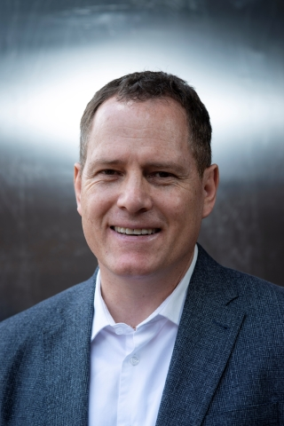

# Nikra-DAP Team 

## Founder - Dr Lukas du Plessis 

Senior Lecturer at the University of Pretoria under the Department of Mechanical and Aeronautical Engineering.

 - Project initiator
 - Contributed to the 'relative movement/Dap Joint' functionality

## Lead Developer - Dr Alfred Bogaers 

Mechanical engineer specialising in computational mechanics and numerical methods.

 - Lead the development in its entirety
 - <Ldp - Insert Text>

## Developers 

### Dewald Hattingh 

Postgraduate Mechanical Engineering student at the University of Pretoria. 

- Contributed to the DapBody initial conditions moddeling
- Contributed to the DapSolver planar motion functionality 
- General UI development 

### Varnu Govender 

3rd year Mechanical Engineering student at the University of Pretoria. 

- Contributed to the DapForce & DapPoint functionality 
- General UI development 
