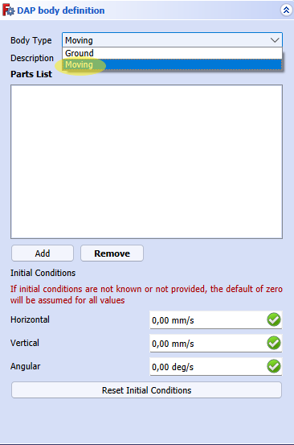

# Simple Pendulum 
This tutorial will show you how to use the Nikra-DAP FreeCAD WorkBench to solve a simple pendulum dynamics problem. Please refer to the README for a basic run-down on all features within Nikra-DAP.

 

# Simple Pendulum tutorial 
## Prerequisites 
In order to progress further with this tutorial, you need to have: 
1. Nikra-DAP WorkBench installed (refer to the **Readme** for further information on installation)
2. FreeCAD Plot WorkBench Installed (available in **Addon Manager**)
3. Assembly 4 WorkBench Installed (available in **Addon Manager**)

## Initial Steps 

An assembly file for the simple pendulum has been made available for purposes of this tutorial. If you are familiar with Assembly 4, you can recreate this assembly, *the steps for this tutorial will not change* 

The assembly files can be found in the **FreeCAD Tutorial Files** folder in **Documentation**, you only need to open the FreeCAD Assembly file. (They have been marked with **OPEN**)

## Opening the WorkBench

Depending on your FreeCAD workflow, you might open your workbenches differently. If you have your workbench panel open in your view finder, you should be able to find the Nikra-DAP WorkBench easily. 

## Setting the parameters 

### Body Selection 

When working with an assembly, you need to select the bodies that need to remain grounded (stationary) as well as select the moving bodies. In our case, the pendulum is a single body that is moving. 

Firstly, open a new Dap Analysis container and select the DapBody selector. 

Once the menu has been opened, you can now select the body type and add bodies to your 'Parts list.' If you have selected a moving part, you can also specify initial conditions. If changes has not been made, it will default to zero. 

You can select **moving** as a body type, for now, lets leave initial conditions unchanged. 

**NB!!** This step is crucial, because the orientions of bodies has now been altered through the Assembly 4 workbench. It is recommended that you make body selections in the *model tree view*

This is illustrated below: 

1. Switch to the model tree view, making selections from the tree view and not the graphic display will ensure that you select the body in the correct formation. 
2. Select the body 
3. Switch back to the DapBody task panel.
4. Click *Add*
5. The body will show up on the parts list, it should also highlight on screen in a different colour. 
6. Click *Ok* or hit *Enter* 

You will notice that the body is highlighted and you can use this to confirm if you have selected the body correctly. Once you have clicked *Ok* you can hover over the DAPBody container and the part will highlight. 

**You have now created a DapBody successfully!!**

### Joint Selection 

Selecting DapJoints, or the relative movement between bodies is up next. 

In our case, we want the pendulum to rotate around a fixed point. We need to use the *'revolute'* joint in this case. The selection of a revolute joint works with the 'One point and two bodies' principle. 

If you have a look at your tree view as well as the graphic display, you will notice that in assembly 4, we have assigned a local coordinate system (LCS) to the top of the pendulum. **This will act as the point about which the pendulum rotates** 

Open the joint selection panel to do this: 

1. Choose the 'rotation' in the drop down box.
2. Select the LCS on screen. 
3. click add point, this will also highlight the LCS to make sure you have selected the correct one. 
4. This is where you select the bodies attached to this point, since you want the pendulum (DapBody001) to rotate around a fixed point, you want one body to be ground and another to be the DapBody that contains the pendulum. 
5. You can click *Ok* or hit *Enter*

**NB! You can select the bodies in any order, Body 1 can be the DapBody and Body 2 can be ground, this should not affect the results. In addition to this, you can also select the LCS in the model tree view, it would be better to make selections in the model tree view but for this case, it was not necessary**

You will notice that a rounded arrow will show up. If this shows up at the correct place, you have chosen the revolute joint/relative movement correctly.

### Material Selection 

Selection DapMaterials is also crucial as the density of materials is taken into account when computing the Moment of Inertia matrix. 

You are welcome to also select your own density if your deisred material is not in the drop down list. 

Open the material selection panel: 

1. Select the DapBody for the material selection
2. Use the drop down menu to select the material. In this case, we will use *Steel-1C22*
3. Click *Ok* or hit *Enter*

**NB!! Remember to do this for each DapBody that you have defined, as a different material might be attached to each DapBody.**

### Force Selection 

A variety of forces can be created in Nikra-DAP. For our pendulum we only need gravity. 

Open the force selection panel: 

In the *Force Type* drop down menu, you can select gravity and click *Ok* or hit *Enter* 

*Note: if you want to play around, you can alter the gravity vector to change the direction in which gravity acts* 

### Running the solver 

Two more steps need to be completed before we can solve this pendulum problem, we need to define the plane of motion as well as define the time steps. 

Open the solver panel: 

A wide variety of options are available for the plane of motion. You are welcome to choose the *X-Y Plane* as the plane of motion. 

However, to illustrate how the 'Master-Sketch' can be selected to define the plane of motion, the following steps need to be followed: 

1. You can first select a save directory, its best to select the folder at which the FreeCAD document is saved.
2. Choose custom plane 

3. The master sketch is technically an 'Object', hence you need to use the 'Object selection window'
4. Switch to the *model tree view*
5. Find the Body_MS... document and then select the sketch that is contained there. This is the master sketch used in Assembly 4
6. Once you have selected it, click *Select*

7. You can define the time steps here.
8. Click Solve and then click *Ok* or hit *Enter*

Depending on your system specifications as well as the reporting time entered, the solve time will vary. Once it is completed, you will see the following message in the *report console*:

### Viewing the animation

Open the animation panel:

Here you can play the animation and also adjust the speed. 

Here is an example of how it should look: 

### Plotting 

Open the plotting selection panel: 

You can plot several different plots and you can view those both in orthonormal coordinates or 3D coordinates. 

For example, let us view a 2D sketch of the path trace of our single pendulum:

1. You can select *path trace* in the plotting drop down menu, here you can also see what other plots can be generated for this mechanism. 
2. Select your coordinate system, in our cae we will use the orthonormal coordinate system. 
3. You can select which bodies in particular that you want to analyse. In our case, we only have a single DapBody. Select it from the drop down menu and click *add*. 
4. Click on *plot* and a new document with your generated plot will be opened. With each new plot you generate a new document will be opened. 

Once the plot has been generated, you will be able to use several controls to interact with the plot. **If you are familiar with how Juypter NoteBook plotting works, the controls are identical to that.**

You are welcome to tinker with your Dap Analysis to explore the other options that are available to you. 

