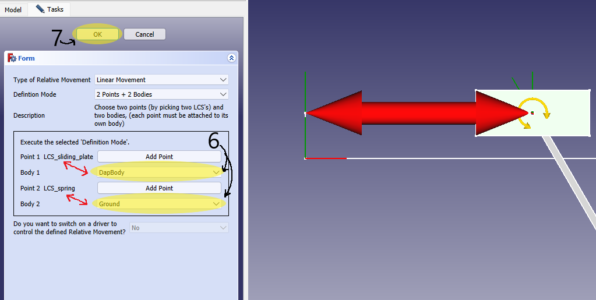

# Sliding Pendulum 
This tutorial will show you how to use the Nikra-DAP FreeCAD WorkBench to solve a sliding pendulum dynamics problem. Please refer to the README for a basic run-down on all features within Nikra-DAP.

 

# Sliding  pendulum tutorial 
## Prerequisites 
In order to progress further with this tutorial, you need to have: 
1. Nikra-DAP WorkBench installed (refer to the **Readme** for further information on installation)
2. FreeCAD Plot WorkBench Installed (available in **Addon Manager**)
3. Assembly 4 WorkBench Installed (available in **Addon Manager**)

## Initial Steps 

Several assembly files for this sliding pendulum have been made available for purposes of this tutorial. Each assembly has been created in a different way. Depending on your Assembly 4 workflow, you might use multiple sub-assemblies or just use bodies directly in your document. *Nikra-DAP* allows you to assign a DapBody to a sub-assembly, **only if the sub-assembly is contained within the assembly and not within another sub-assembly**

The assembly files can be found in the **FreeCAD Tutorial Files** folder in **Documentation**, you only need to open the FreeCAD Assembly file. (They have been marked with **OPEN**.)
There are two options for each type of assembly, both options are functional within Nikra-DAP. 

## Opening the WorkBench

Depending on your FreeCAD workflow, you might open your workbenches differently. If you have your workbench panel open in your view finder, you should be able to find the Nikra-DAP WorkBench easily. 

## Setting the parameters 

## Body Selection 

When working with an assembly, you need to select the bodies that need to remain grounded (stationary) as well as select the moving bodies. In our case, we will have two moving bodies: the sliding plates as well as the pendulum. 

Firstly, open a new Dap Analysis container and select the DapBody selector. 

Once the menu has been opened, you can now select the body type and add bodies to your 'Parts list.' If you have selected a moving part, you can also specify initial conditions. If changes has not been made, it will default to zero. 

You can select **moving** as a body type, for now, lets leave initial conditions unchanged. 

**NB!!** This step is crucial, because the orientions of bodies has now been altered through the Assembly 4 workbench. It is recommended that you make body selections in the *model tree view*

We will first create a DapBody for the sliding plates: 

1. Switch to the *model tree view* 
2. Select the *Body_fused_sliding_plates*, it should also highlight in the graphic display. 

3. Switch back to the *DapBody task panel* 
4. Click *add*, this will populate the parts list. 
5. The body will show on the parts list and should also be highlighted on screen. 

You can click *Ok* or hit *Enter* 

A DapBody has now been assigned to the sliding plates, but you would also have to repeat these steps for the pendulum. 

Let us repeat these steps: 

The pendulum now contains more than one body. In Nikra-DAP, you can attach several bodies to one DapBody. We will utilise this function here. 

A compound object will be created using all the selected bodies. 

### Using a body or sub-assembly within Assembly 4 

Nikra-DAP allows you to assign a Dap Body to either a body or sub-assembly. There is limitations to this unfortunately as you aren't permitted to choose a sub-assembly that is nested in another sub-assembly. It has contained within the Assembly 4 container itself. The same gooes for bodies that are contained within the sub-assembly. 

The steps for body selection does not change however:

 

## Joint Selection

Selecting DapJoints, or the relative movement between bodies is up next. 

In our case, we need to define relative movement in two places, a linear translational movement between the origin and the sliding plate as well as a revolute motion between the pendulum and the sliding plates. 

The selection process would need to be undertaken twice for this. 

Open the joint selection panel to do this: 

We are going to define the revolute motion first: 

1. Switch to the *model tree view* 

**Side note: The use of the master sketch in Assembly 4 is important and is also a crucial step in this tutorial. In order to create this assembly several LCS's were assigned. For purposes of this tutorial, we will only use LCS objects found in the Body_MS Document**

2. Select the LCS_pendulum object, this is the point about which the pendulum and the sliding plates are attached and serves as the fixed point of rotation. 
3. Switch back to the *DapJoint task panel*
4. Click *Add point*, this should also highlight the LCS on screen. 
5. This is where you select the bodies attached to this point, you can assign each of your previously attached DapBody objects to Body 1 & 2. The order in this case is not important. 
6. Click *OK* or hit *Enter* 

**If the rounded arrow appears in the correct position, you have successfully created a revolute joint between the pendulum and the sliding plates.** 

Let us assign Linear movement to the sliding plate between its current position and the origin. 

Create a new Dap Joint container:

1. Use the drop down menu and select the *Linear movement* option. 
2. Switch to the *model tree view* 

In order to correctly assign a linear translation joint to a body (or collection of bodies), you need to define two fixed points and the bodies that are attached to that point. 

Let us handle the point selection first:

3. Select the *LCS_sliding_plate*, it will highlight in the graphic display. 
4. Switch back to the *DapJoint task panel* and Click *Add point* at **Point 1**

Repeat this step for the LCS_Spring:

6. Now select the bodies attached to these points, **make sure they are linked correctly**
7. If you have selected your bodies correctly, a red arrow will appear on the graphic display in the illustrated position. 

## Material Selection 

Selecting DapMaterials is also crucial as the density of materials is taken into account when computing the Moment of Inertia matrix. 

You are welcome to also select your own density if your deisred material is not in the drop down list. 

Open the material selection panel: 

You will notice a drop down menu that contains the DapBodies that you previously created. Once you have selected a certain DapBody, all objects that are contained in this DapBody will become visible in the table. You are able to assign a material to each object individually. 

In our case, we will use *Steel-1C22* consistently throughout the entire assembly. This is illustrated as follows:

Once you are happy, click *Ok* or hit *Enter* 

## Force Selection 

A variety of forces can be created in Nikra-DAP. For our assembly, we need to define gravity and also attach a spring between the Sliding Plates and the origin (along the path of the *Linear Translation* joint)

Let us define gravity first, open the force selection panel: 

In the *Force Type* drop down menu, you can select gravity and click *Ok* or hit *Enter* 

*Note: if you want to play around, you can alter the gravity vector to change the direction in which gravity acts* 

Now let us define the spring force, open a new DapForce container: 

1. In the *Force Type* drop down menu, you can select Spring. 

**The process to create a spring is identical to the *Linear Translation Joint***

2. Switch to the *model tree view* 
3. Select the LCS_Spring 
4. Switch back to the *DapForce task panel* 
5. Click *Add Point* next to **Point 1**
6. Switch back to the *model tree view* and select LCS_sliding_plate 
7. Switch back to the *DapForce task panel* 
8. Click *Add Point* next to **Point 2**
9. Select the bodies that are attached to **Points 1 & 2**. Make sure that you have done this correctly. 
10. You can now add parameters to the spring, for this assembly we used 20 Nm for stiffness and an undeformed length of 600mm. You can however play around with this and see how it affects the results. 
11. Click *OK* or hit *Enter* 

If you have done this correctly, the spring will appear in the correct position as illustrated:

## Running the solver 

Two more steps need to be completed before we can solve this sliding pendulum problem, we need to define the plane of motion as well as define the time steps. 

A wide variety of options are available for the plane of motion. You are welcome to choose the *X-Y Plane* as the plane of motion and proceed to define the time steps and solve. 

However, to illustrate how the 'Master-Sketch' can be selected to define the plane of motion, the following steps need to be followed: 

You can first select a save directory, its best to select the folder at which the FreeCAD document is saved.

1. In the drop down menu, choose *custom plane* 
2. The master sketch is technically an 'Object', hence in this drop down menu you need to choose *object selection*
3. Switch to the *model tree view*
4. Find the 'Body_MS...' document and then select the sketch that is contained there. This is the **Master-Sketch** used in Assembly 4
5. Switch back to the *DapSolver task panel*
6. Click *Select*
7. You can define the time steps here.
8. Click Solve

Depending on your system specifications as well as the reporting time entered, the solve time will vary. Once it is completed, you will see the following message in the *report console*:

9. If you are happy, click *OK* or hit *Enter* 

## Viewing the animation

Open the animation panel:

Here you can play the animation and also adjust the speed. 

Here is an example of how it should look: 

**NB! At the time of making this tutorial, the animation for any spring forces had not been fully developed**

## Plotting 

Open the plotting selection panel: 

You can plot several different plots and you can view those both in orthonormal coordinates or 3D coordinates. 

For example, let us view a 2D sketch of the positions of our pendulum (DapBody001):

1. You can select *position* in the plotting drop down menu, here you can also see what other plots can be generated for this mechanism. 
2. Select your coordinate system, in our case we will use the orthonormal coordinate system. 
3. You can select which bodies in particular that you want to analyse. Select *DapBody001* from the drop down menu and click *add*. 
4. Click on *plot* and a new document with your generated plot will be opened. With each new plot you generate a new document will be opened. In this case, because we have two components for the position, it has been plotted individually in the X & Y directions. 

Once the plot has been generated, you will be able to use several controls to interact with the plot. **If you are familiar with how Juypter NoteBook plotting works, the controls are identical to that.**

You are welcome to tinker with your Dap Analysis to explore the other options that are available to you. 

