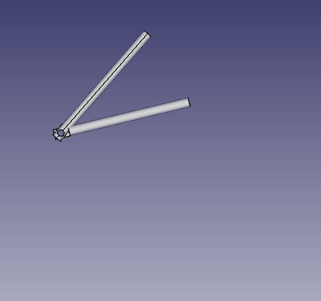

# FreeCAD Nikra-DAP WorkBench

The FreeCAD Nikra-DAP WorkBench is a planar multibody dynamics workbench that is based on Prof. Nikravesh's DAP solver. 

## [Example of a multibody planar dynamic mechanism](./Documentation/Tutorials/Double_Pendulum/Double_Pendulum.MD)

 

# Acknowledgments

## Professor Parviz E. Nikravesh

Prof. Nikravesh's work on computational dynamics has lead to the creation of the Nikra-DAP workbench. Formulations were adapted from **Planar Multibody Dynamics (Parviz E. Nikravesh) 2nd Ed**

 

## Thank you to our funders:

- This project is funded through Engineering X, an international collaboration founded by the Royal Academy of Engineering and Lloyd's Register Foundation.

- This project is also part of the Engineering X Engineering Skills Where They are Most Needed Mission, which seeks to support the delivery of skills and education programmes that will lead to development of much needed engineering skills capacity, enhanced      safety standards, and infrastructure that will remain safe and fit for purpose.

 

# [Nikra-DAP Team](./Documentation/Nikra-DAP-Team.MD)

# Installation

This workbench can be installed locally by copying the *Nikra-DAP* file into the **Mod** folder in your FreeCAD directory. 

In order for this workbench to work correctly. **FreeCAD Plot** as well as **Assembly 4** should also be installed on your computer through the addon manager. 

*Why Assembly 4?* 

FreeCAD has been infamously known for its topological naming issue. Meaning that whenever you have an assembly opened in Assembly 2, you could not edit an indidivual part geometry without the assembly breaking and forcing you to start over.

**Assembly 4** fixes this issue as you can make edits to your part geometries and it will update accordingly. This is due to the usage of a local coorindate system (LCS) feature that allows you to attach an LCS to a body and use this LCS to create mates with other bodies. In addition to this, **Assembly 4** also makes use of a 'Master Sketch' to aid in the alignment of bodies in your assembly as well as animating movement.   

*Nikra-DAP* was designed with **Assembly 4** in mind and makes use of the LCS, Master Sketch and Sub-Assemblies when creating a DAP mechanism. 

*However*, *Nikra-DAP* does still work well with Assembly 2 files. It is recommended however that a mechanism created in **Assembly 4** is used. 

 

# Basic Overview 

In order to utilise the Nikra-DAP solver to solve planar dynamic problems. Several analysis parameters needs to be defined. 

These parameters are defined as follows: 

* DapBody: A single body that forms part of a multibody system. The equations of motion are then constructed for this body by using the body-coordinate method. (Nikravesh, 2019) These can be defined as either ground or moving and initial conditions can be assigned to them.

* DapJoint: This defines the Degrees of Freedom between several bodies or between a body and ground. This can either be revolute or linear translation. 

* DapForce:  Forces such as gravity, a linear spring, linear damper, rotational (torsional) spring and rotational damper are options and its placement in the mechanism can also be selected. **(This makes use of the LCS assigned to a body as well as the body itself)** 

* DapMaterial: This defines the material properties for each DapBody. You can also manually insert a density if your material is not shown in the list. 

* DapSolver: Allows you to select the plane of motion and also the time step. The plane of motion can be one of the cartesian planes, a plane auto-generated from a selected object. From an Assembly 4 standpoint, by using the object selection feature, you can select the master sketch and use the plane of motion defined within the master sketch. 

* DapAnimate: Once the solver has completed, you can then view an animation of the DAP Mechanism. 

* DapPlot: Several plots can be generated for each of the bodies. These plots include: position, velocity, a path trace as well as energies. These can be plotted in orthonormal coordinates or 3D co-coordinates. 

 

# Tutorials 

A variety of planar dynamic problems can be modelled in Nikra-DAP. We have compiled three tutorials that demonstrates the functionality of Nikra-DAP: 

- [Simple Pendulum](./Documentation/Tutorials/Simple_Pendulum/Simple_Pendulum.MD)
- [Double Pendulum](./Documentation/Tutorials/Double_Pendulum/Double_Pendulum.MD)
- [Sliding Pendulum](./Documentation/Tutorials/Sliding_Pendulum/Sliding_Pendulum.MD)

